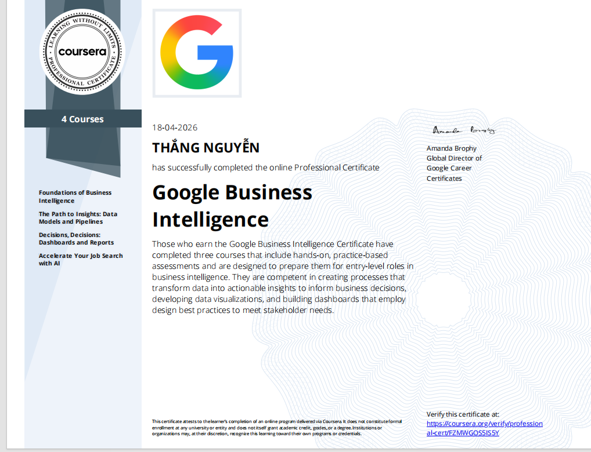
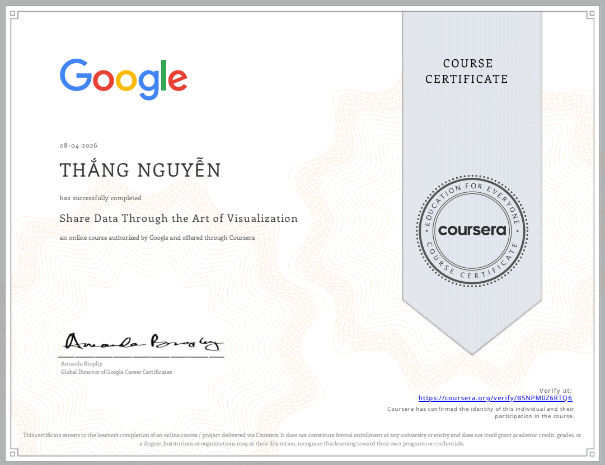
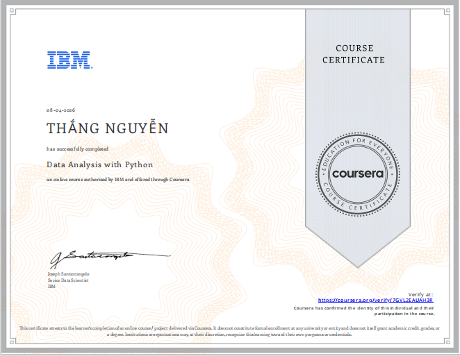
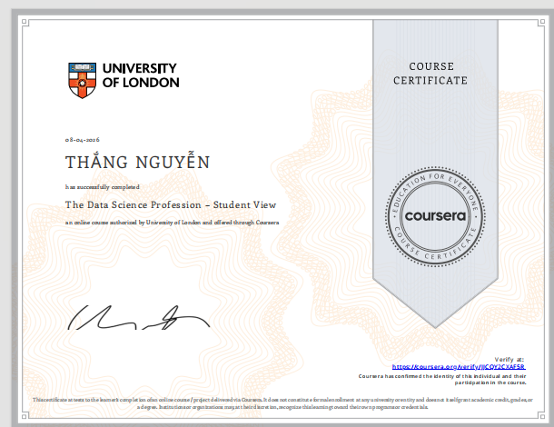

<h1 align="center" style="
    font-size: 56px;
    font-weight: bold;
    background: linear-gradient(to right, #00c6ff, #0072ff);
    -webkit-background-clip: text;
    -webkit-text-fill-color: transparent;
">
    Nguyễn Lê Hùng Thắng
</h1>

<div align="center">

### 📊 Data Science Enthusiast | Data Engineer | Data Analyst 📊

**_✨ Transforming data into actionable insights ✨_**

[](https://git.io/typing-svg)

---

[🌐 Portfolio](#featured-projects) • [💼 LinkedIn](https://www.linkedin.com/in/hùng-thắng-nguyễn-lê-9bb786352) • [📧 Email](mailto:nlhungthang18@gmail.com) • [⭐ Star](#) • [🤝 Connect](#)

[](https://visitcount.itsvg.in)

</div>

---

## `🎯 About Me`

Hello! I'm **Hungthang**, a passionate **Data Science** student at Nguyen Tat Thanh University, currently specializing in **Data Engineering** and **Data Analytics**. I'm driven by the mission to extract meaningful insights from data and solve real-world problems using cutting-edge technologies.

<table align="center">
<tr>
<td align="center">

🎓 **Education**

Nguyen Tat Thanh<br/>University (NTTU)<br/>**Data Science Major**

</td>
<td align="center">

📍 **Location**

Ho Chi Minh City<br/>Vietnam 🇻🇳

</td>
<td align="center">

💬 **Languages**

Vietnamese (Native)<br/>English (B2 Level)

</td>
<td align="center">

👤 **Pronouns**

He / Him

</td>
</tr>
</table>

---

## `🚀 Career Goals`

<div align="center">

| 📍 Timeline | 🎯 Goals | ✅ Status |
|:---:|:---|:---:|
| **🔨 Short-term** | Master Python, R, SQL, Data Engineering | ⏳ In Progress |
| **📊 Mid-term** | Build ML & Analytics projects | 🚀 Active |
| **🎯 Long-term** | Professional Data Scientist with AI expertise | 🌟 Target |

</div>

---

## `💻 Technical Skills`

### 🔹 Languages & Frameworks
<div align="center">


</div>

### 🔹 Data Science & Analytics
<div align="center">


</div>

### 🔹 Data Engineering & Tools
<div align="center">


</div>

### 🔹 Web & Mobile
<div align="center">


</div>

---

## `📚 Currently Learning`

<table align="center">
<tr>
<td align="center"><b>🐍 Python for Data</b></td>
<td align="center"><b>🗄️ SQL & Databases</b></td>
<td align="center"><b>🔄 ETL/ELT</b></td>
</tr>
<tr>
<td>pandas, NumPy<br/>scikit-learn</td>
<td>Query Optimization<br/>Database Design</td>
<td>Data Orchestration<br/>Workflow Automation</td>
</tr>
<tr>
<td align="center"><b>📊 EDA & Viz</b></td>
<td align="center"><b>📈 R & Statistics</b></td>
<td align="center"><b>🤖 Machine Learning</b></td>
</tr>
<tr>
<td>Advanced Visualization<br/>Data Storytelling</td>
<td>Time Series<br/>Statistical Inference</td>
<td>Supervised Learning<br/>Model Optimization</td>
</tr>
</table>

---

## `🎓 Education & Certifications`

### 🏫 University
<div align="center">

| 📚 Institution | Major | Status |
|---|---|---|
| **Nguyen Tat Thanh University (NTTU)** | 🎯 Data Science | 🎓 Pursuing |

</div>

### 📜 Certifications & Courses
| # | 📖 Course | 🏢 Platform | ✅ Status |
|:---:|---|---|:---:|
| 1️⃣ | Java Fundamentals | TEK4.vn, W3Schools | ✅ |
| 2️⃣ | Python for Beginners | TEK4.vn, W3Schools | ✅ |
| 3️⃣ | C/C++ Basics | TEK4.vn, W3Schools | ✅ |
| 4️⃣ | **Google Data Analytics Professional Certificate** | **Google via Coursera** | ✅ [View Certificate](certificates/Coursera%20D4KS36VEMTGU.pdf) |
| 5️⃣ | **Data Analysis with Python** | **IBM via Coursera** | ✅ [View Certificate](certificates/Coursera%200QO9QUQA96N2.pdf) |
| 6️⃣ | **Prepare Data for Exploration** | **Google via Coursera** | ✅ [View Certificate](certificates/Coursera%207GVL2EAUAH3R.pdf) |
| 7️⃣ | **Process Data from Dirty to Clean** | **Google via Coursera** | ✅ [View Certificate](certificates/Coursera%20QVE6RSQYKFX8.pdf) |
| 8️⃣ | **Analyze Data to Answer Questions** | **Google via Coursera** | ✅ [View Certificate](certificates/Coursera%20CZT3KSAS8N6U.pdf) |
| 9️⃣ | **Share Data Through the Art of Visualization** | **Google via Coursera** | ✅ [View Certificate](certificates/Coursera%20B5NPM0Z6RTQ6.pdf) |
| 🔟 | **The Data Science Profession** | **University of London via Coursera** | ✅ [View Certificate](certificates/Coursera_JJCQY2CXAF5R.pdf) |
| 1️⃣1️⃣ | **Google Business Intelligence Professional Certificate** | **Google via Coursera** | ✅ [View Certificate](certificates/Coursera_FZMWGOS5IS5Y.pdf) |

---

###   **Certifications Badges**

<div align="center">


</div>

---

###  🎯 **Certificate Gallery**

<div align="center">

#### 🏆 **Professional Certifications**

<table>
<tr>
<td align="center" width="50%">

**📜 Google Data Analytics Professional Certificate**
<br/>
**Google | Coursera (9 Courses)**
<br/>
✅ April 2026
<br/><br/>

[](certificates/Coursera%20QVE6RSQYKFX8.pdf) 

[📥 View PDF](certificates/Coursera%20D4KS36VEMTGU.pdf) • [🔗 Verify](https://www.coursera.org/account/accomplishments/specialization/D4KS36VEMTGU)

</td>
<td align="center" width="50%">

**📜 Google Business Intelligence Certificate**
<br/>
**Google | Coursera (4 Courses)**
<br/>
✅ April 2026
<br/><br/>

[](certificates/Coursera%20FZMWGOS5IS5Y.pdf) 

[📥 View PDF](certificates/Coursera%20FZMWGOS5IS5Y.pdf) • [🔗 Verify](https://www.coursera.org/account/accomplishments/specialization/FZMWGOS5IS5Y)
<tr>
<td align="center" width="50%">

**📜 Prepare Data for Exploration**
<br/>
**Google | Coursera**
<br/>
✅ April 2026
<br/><br/>

[](certificates/Coursera%200QO9QUQA96N2.pdf)

[📥 View PDF](certificates/Coursera%200QO9QUQA96N2.pdf) • [🔗 Verify](https://www.coursera.org/account/accomplishments/verify/0QO9QUQA96N2)

</td>
<td align="center" width="50%">

**📜 Process Data from Dirty to Clean**
<br/>
**Google | Coursera**
<br/>
✅ April 2026
<br/><br/>

[](certificates/Coursera%200QO9QUQA96N2.pdf)

[📥 View PDF](certificates/Coursera%20QVE6RSQYKFX8.pdf) • [🔗 Verify](https://www.coursera.org/account/accomplishments/verify/QVE6RSQYKFX8)

</td>
</tr>
<tr>
<td align="center" width="50%">

**📜 Analyze Data to Answer Questions**
<br/>
**Google | Coursera**
<br/>
✅ April 2026
<br/><br/>

[](certificates/Coursera%20CZT3KSAS8N6U.pdf)

[📥 View PDF](certificates/Coursera%20CZT3KSAS8N6U.pdf) • [🔗 Verify](https://www.coursera.org/account/accomplishments/verify/CZT3KSAS8N6U)

</td>
<td align="center" width="50%">

**📜 Share Data Through the Art of Visualization**
<br/>
**Google | Coursera**
<br/>
✅ April 2026
<br/><br/>

[](Coursera%20B5NPM0Z6RTQ6.pdf)

[📥 View PDF](certificates/Coursera%20B5NPM0Z6RTQ6.pdf) • [🔗 Verify](https://www.coursera.org/account/accomplishments/verify/B5NPM0Z6RTQ6)

</td>
</tr>
<tr>
<td align="center" width="50%">

**📜 Data Analysis with Python**
<br/>
**IBM | Coursera**
<br/>
✅ April 2026
<br/><br/>

[](certificates/Coursera%200QO9QUQA96N2.pdf)

[📥 View PDF](certificates/Coursera%200QO9QUQA96N2.pdf) • [🔗 Verify](https://www.coursera.org/account/accomplishments/verify/0QO9QUQA96N2)

</td>
<td align="center" width="50%">

**📜 The Data Science Profession – Student View**
<br/>
**University of London | Coursera**
<br/>
✅ April 2026
<br/><br/>

[](certificates/Coursera%20JJCQY2CXAF5R.pdf)

[📥 View PDF](certificates/certificates/Coursera%20JJCQY2CXAF5R.pdf) • [🔗 Verify](https://www.coursera.org/account/accomplishments/verify/JJCQY2CXAF5R)

</td>
</tr>
</table>

</div>

---

## 🏆 Achievements

- 🥇 **Certificate of Merit (BEST)**
  - Computer Network System Deployment Contest
  - Faculty of Information Technology, NTTU
  - April 2024

- 🎓 **Coursera Certifications**
  - Google Data Analytics Professional Certificate (9 Courses) - 2026
  - Data Analysis with Python (IBM) - 2026
  - Prepare Data for Exploration (Google) - 2026
  - Process Data from Dirty to Clean (Google) - 2026
  - Analyze Data to Answer Questions (Google) - 2026
  - Share Data Through the Art of Visualization (Google) - 2026

---

## `💼 Featured Projects`

### ✨ [1] 🐦 Twitter Clone - Social Media Application

**Multi-platform Social Media with Real-time Features**

> A comprehensive Twitter/X clone built with **Flutter** and **Firebase**, demonstrating professional mobile app development with real-time data synchronization.

```
✅ User authentication & profiles     ✅ Tweet creation & engagement
✅ Real-time Firestore updates        ✅ Dark/Light theme support
✅ Cross-platform (6+ platforms)      ✅ Follow system & discovery
```

**Tech Stack**: `Flutter` `Dart` `Firebase` `Cloud Firestore` `Provider`

[📂 Repository](https://github.com/Hungthang1234/Social-Media-ProJect-Twitter-Clone) | [⭐ Star](#) | 

---

### ✨ [2] 📊 DataRnAPP - Company Data Manager

**Full-Featured Data Management & Cleaning Platform**

> Complete data solution with multiple interfaces: Streamlit Web, Tkinter Desktop, PySimpleGUI (Executable)

```
✅ CSV/Excel import                   ✅ Advanced data cleaning pipeline
✅ SQLite persistence                 ✅ Search, filter & analytics
✅ Export to multiple formats         ✅ Build to .exe executable
```

**Tech Stack**: `Python` `Pandas` `Streamlit` `Tkinter` `SQLite` `Plotly`

[📂 Repository](https://github.com/Hungthang1234/DataRnAPP) | [](https://github.com/Hungthang1234/DataRnAPP)

---

### ✨ [3] 🏠 Real Estate Price Prediction - Thesis Project

**Machine Learning Model for Housing Price Forecasting**

> Capstone project with comprehensive ML models, data analysis, and interactive Jupyter notebooks

```
✅ Data exploration & visualization   ✅ Multiple ML models (XGBoost, etc)
✅ Google Colab & Jupyter notebooks   ✅ Full documentation & reports
✅ GitHub Actions CI/CD               ✅ Feature engineering & analysis
```

**Tech Stack**: `Python` `Pandas` `Scikit-learn` `Jupyter` `Google Colab`

[📂 Repository](https://github.com/Hungthang1234/DO-AN-TOT-NGHIEP) | [](https://github.com/Hungthang1234/DO-AN-TOT-NGHIEP)

---

### ✨ [4] 🏦 ACB Bank Financial Analysis

**Comprehensive Banking Analytics with Power BI Dashboard**

> Financial analysis project featuring interactive dashboards and detailed business intelligence reports

```
✅ Power BI dashboards                ✅ Financial report generation
✅ Bank metrics analysis              ✅ Market data processing
✅ Historical price tracking          ✅ Executive summaries (PPT/Word)
```

**Tech Stack**: `Power BI` `Excel` `Data Analysis`

[📂 Repository](https://github.com/Hungthang1234/ACB-Bank-DataAnalyst) | [](https://github.com/Hungthang1234/ACB-Bank-DataAnalyst)

---

## `🛠️ My Working Philosophy`

<div align="center">

| 🎯 Principle | 📝 Description |
|:---:|---|
| ✨ | **Reproducibility** — Clean, well-documented notebooks |
| 🔀 | **Version Control** — Meaningful commits & proper Git workflow |
| 📝 | **Transparency** — Clear documentation of assumptions |
| 🎯 | **Quality** — Focus on code & data quality |

</div>

---

## `📞 Get In Touch`

<div align="center">

### 📲 **Main Contacts**

| Platform | Link | Status |
|:---:|:---|:---:|
| 💼 LinkedIn | [Hùng Thắng Nguyễn Lê](https://www.linkedin.com/in/thắng-nguyễn-lê-hùng-9bb786352/?locale=en) |  |
| 🐙 GitHub | [Hungthang1234](https://github.com/Hungthang1234) |  |
| 📧 Gmail | nlhungthang18@gmail.com |  |
| 💬 Discord | hungthang_nguyenle8 |  |
| 📱 Phone | 0828904478 |  |

### 🌐 **Social Media & More**

<div align="center">

[](https://www.facebook.com/thang.hung.58760/)
[](https://www.facebook.com/hung.thang.385092)
[](https://www.instagram.com/takamahari)
[](https://www.tiktok.com/@thangnguyen_81976)

</div>

📍 **Location**: Ho Chi Minh City, Vietnam 🇻🇳

</div>

---

<div align="center">

<h3>✨ Let's Build Something Amazing Together! ✨</h3>

[](https://github.com/Hungthang1234)
[](https://github.com/Hungthang1234)

### 🚀 **My Mission**
> _"Data is the new oil, and I'm here to refine it into actionable insights."_

#### ⚡ Quick Stats


```
╔═══════════════════════════════════════════════════════════╗
║  🎯 Current Focus: Data Science & Machine Learning       ║
║  📈 Learning: Advanced Analytics & Big Data Solutions    ║
║  🤝 Open to: Collaboration & Full-time Opportunities    ║
║  💡 Passion: Turning Data Into Impact                   ║
╚═══════════════════════════════════════════════════════════╝
```

---

### 🙏 **Thank You for Visiting!**

```diff
+ Made with ❤️ by Hùng Thắng Nguyễn Lê
+ © 2026 | Continuous Learning & Innovation
+ 🌟 Let's connect and grow together!
```

**[↑ Back to Top](#)**

</div>
